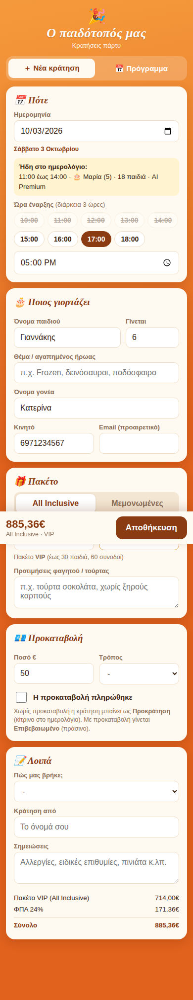
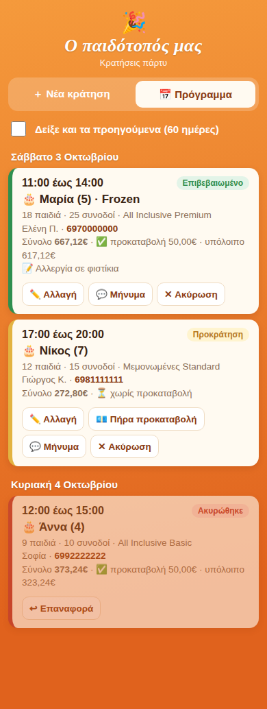
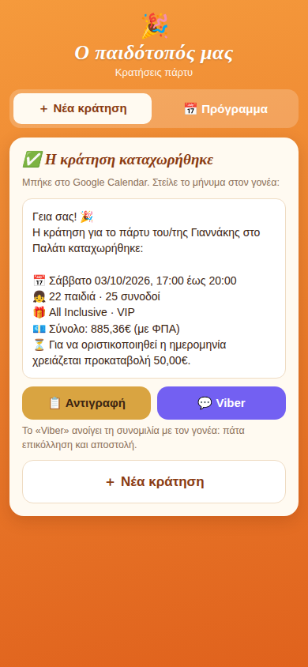

# 🎉 Party Booking · Κρατήσεις παιδικών πάρτυ με Google Calendar

Δωρεάν, open source σύστημα κρατήσεων για παιδότοπους και χώρους παιδικών πάρτυ.
Φόρμα στο κινητό ➜ Google Sheet ➜ Google Calendar, αυτόματα. Χωρίς server, χωρίς συνδρομή: τρέχει μέσα στον δικό σου λογαριασμό Google (Apps Script).

*English: a free, zero-server booking system for kids' party venues. A mobile form writes to a Google Sheet and creates Google Calendar events automatically, with availability checks, package pricing, deposit tracking, a ready-to-send Viber/WhatsApp message and a daily email digest. The UI is in Greek; all texts live in `Code.gs` and `Index.html` and are easy to translate.*

  
  
  

## Τι κάνει

- **Φόρμα κινητού με PIN** για όποιον κλείνει πάρτυ (ιδιοκτήτης, συνεργάτες, προσωπικό).
- **Έλεγχος διαθεσιμότητας**: διαλέγεις μέρα και βλέπεις τι είναι ήδη κλεισμένο. Οι ώρες που συγκρούονται (μαζί με τον χρόνο καθαρισμού) εμφανίζονται διαγραμμένες, και παίρνεις προειδοποίηση πριν κλείσεις δύο πάρτυ την ίδια ώρα.
- **Αυτόματη τιμή**: επιλογή πακέτου από τον αριθμό παιδιών, All Inclusive ή Μεμονωμένες επιλογές, επιπλέον παιδιά, ποτά συνοδών, φαγητό, τούρτα, ΦΠΑ, υπόλοιπο.
- **Google Calendar** με χρώμα ανά κατάσταση: 🟡 Προκράτηση (χωρίς προκαταβολή), 🟢 Επιβεβαιωμένο, ⚪ Ολοκληρώθηκε. Οι ακυρώσεις φεύγουν από το ημερολόγιο.
- **Έτοιμο μήνυμα για τον γονέα** (Viber ή οποιαδήποτε εφαρμογή) με link «προσθήκη στο ημερολόγιό σας».
- **Email επιβεβαίωσης** στον γονέα, αν δώσει email.
- **Καθημερινή σύνοψη** στο email σου: πάρτυ αύριο, ποια δεν έχουν δώσει προκαταβολή, πρόγραμμα εβδομάδας, νέες κρατήσεις, αναμενόμενος τζίρος.
- **Στατιστικά**: πάρτυ, παιδιά, τζίρος, % All Inclusive και ακυρώσεις ανά μήνα, και «Πώς μας βρήκαν».
- Αλλαγές **απευθείας στο Sheet** ενημερώνουν μόνες τους το Calendar.

## Εγκατάσταση (περίπου 10 λεπτά)

Κάν' το με τον λογαριασμό Google της επιχείρησης.

1. Άνοιξε το **sheets.new**.
2. **Επεκτάσεις ➜ Apps Script**.
3. Στο `Code.gs` σβήσε ό,τι υπάρχει και επικόλλησε το [`Code.gs`](Code.gs).
4. **＋ ➜ HTML**, όνομα ακριβώς `Index`, και επικόλλησε το [`Index.html`](Index.html).
5. Αποθήκευση. Διάλεξε τη συνάρτηση **setup** ➜ **Εκτέλεση** και δώσε τις άδειες (Sheets, Calendar, Gmail). Στο «Η Google δεν έχει επαληθεύσει την εφαρμογή»: **Σύνθετες ρυθμίσεις ➜ Μετάβαση σε…**. Είναι δικό σου script.
   Το μήνυμα στο τέλος σου δείχνει το **PIN** της φόρμας (τυχαίο, 6 ψηφία).
6. **Ανάπτυξη ➜ Νέα ανάπτυξη ➜ ⚙ ➜ Εφαρμογή ιστού**. Εκτέλεση ως: **Εγώ**. Πρόσβαση: **Οποιοσδήποτε**. Αντέγραψε το URL (`https://script.google.com/macros/s/.../exec`).
7. Στο φύλλο **Ρυθμίσεις** συμπλήρωσε `BUSINESS_NAME`, `ADDRESS`, `PHONE` και τα email για τη σύνοψη. Στο φύλλο **Πακέτα** βάλε τα δικά σου πακέτα και τιμές.
8. Άνοιξε το URL στο κινητό ➜ **Προσθήκη στην αρχική οθόνη**.
9. Μοιράσου το νέο ημερολόγιο «… · Πάρτυ» με όσους θέλεις να βλέπουν το πρόγραμμα.

> Η φόρμα δουλεύει **μόνο** από το URL της εφαρμογής ιστού. Αν ανοίξεις σκέτο το αρχείο `Index.html` δεν μπορεί να συνδεθεί με το Google.

**Ενημέρωση κώδικα αργότερα:** Ανάπτυξη ➜ Διαχείριση αναπτύξεων ➜ ✏️ ➜ Έκδοση: **Νέα έκδοση**. Το URL μένει το ίδιο.

Προαιρετικά, με [clasp](https://github.com/google/clasp): `clasp create --type sheets`, μετά `clasp push` (περιλαμβάνεται `appsscript.json`).

## Ρυθμίσεις (χωρίς κώδικα)

| Φύλλο | Τι αλλάζεις |
|---|---|
| **Πακέτα** | όνομα, όριο παιδιών/συνοδών, τιμή Μεμονωμένες, τιμή All Inclusive |
| **Ρυθμίσεις** | όνομα, PIN, διάρκεια πάρτυ, λεπτά καθαρισμού, πάρτυ ταυτόχρονα, ωράριο, προκαταβολή, ΦΠΑ, επιπλέον παιδί, ποτό συνοδού, τούρτα/κιλό, εκτύπωση θέματος, email και ώρα σύνοψης |

Μετά από αλλαγή τιμών: μενού **🎉 Κρατήσεις ➜ Συγχρονισμός όλων με Calendar**. Μετά από αλλαγή ώρας σύνοψης: **🎉 Κρατήσεις ➜ Αρχική εγκατάσταση / επισκευή** (δεν σβήνει δεδομένα).

## Πώς υπολογίζεται η τιμή

- Πακέτο = το μικρότερο που χωράει τα παιδιά. Πάνω από το μεγαλύτερο: + «επιπλέον παιδί».
- Πακέτο, επιπλέον παιδιά και ποτά συνοδών είναι χωρίς ΦΠΑ. Προστίθεται ο ΦΠΑ.
- Φαγητό, τούρτα και εκτύπωση θέματος (μόνο στις Μεμονωμένες) μπαίνουν σε τελική τιμή.
- All Inclusive: όλα μέσα στην τιμή του πακέτου.

Η ίδια λογική υπάρχει στο `calcPrice()` (Code.gs) και στο `calc()` (Index.html). Αν αλλάξεις τη μία, άλλαξε και την άλλη.

## Ασφάλεια και ιδιωτικότητα

- Τα δεδομένα μένουν στο δικό σου Google Drive και Calendar. Δεν στέλνεται τίποτα σε τρίτους.
- Η φόρμα προστατεύεται με PIN. Όποιος έχει το URL **και** το PIN μπορεί να δει και να αλλάξει κρατήσεις, οπότε δώσε τα μόνο στο προσωπικό και άλλαξε το PIN όταν φεύγει κάποιος.
- Τα στοιχεία γονέων είναι προσωπικά δεδομένα (GDPR): κράτα μόνο ό,τι χρειάζεσαι και μοιράσου το Sheet μόνο με όσους πρέπει.

## Συνεισφορά

Pull requests και issues ευπρόσδεκτα: μεταφράσεις, WhatsApp, πολλές αίθουσες, online προκαταβολή κ.λπ.

## Άδεια

[MIT](LICENSE) · Αρχικά φτιάχτηκε για τον παιδότοπο **Το Παλάτι** (Γέρακας).
